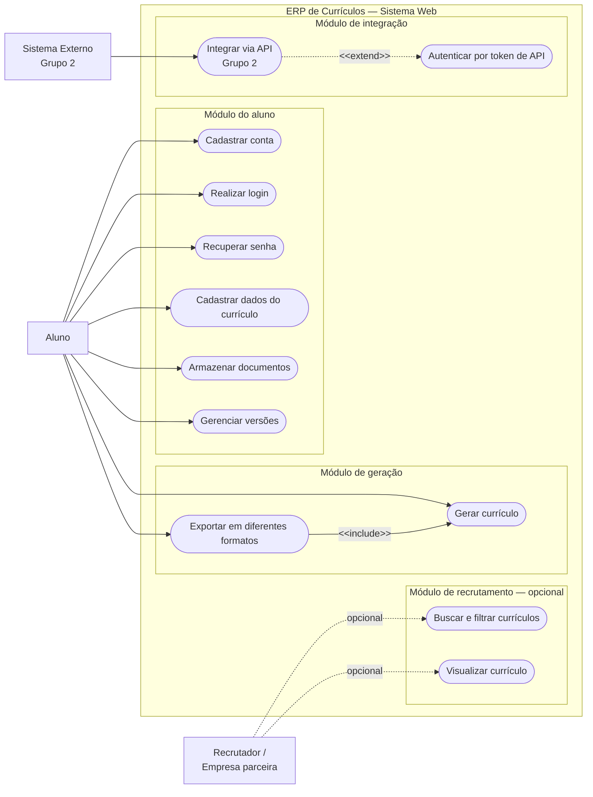

# Casos de uso — Sistema de Currículos

## Visão geral

O sistema apoia alunos da FATEC-SP na preparação, construção, gestão e
exportação de currículos. O ator principal é o **Aluno**, e a integração com o
Sistema Externo do Grupo 2 permite sincronizar dados com uma plataforma parceira.

O papel de recrutador não faz parte do escopo principal de apoio ao aluno. Ele
pode ser incluído se o projeto exigir busca e visualização de currículos por
empresas parceiras.

## Atores

- **Aluno (FATEC-SP / em busca de estágio):** cria e gerencia seus dados,
  currículos e exportações.
- **Sistema Externo (Grupo 2):** integra-se ao sistema por API para sincronizar
  dados de currículo ou vagas.
- **Recrutador / Empresa parceira (opcional):** busca, filtra e visualiza
  currículos quando esse requisito estiver no escopo.

## Diagrama de casos de uso

## Casos de uso identificados

| Identificador | Caso de uso | Ator principal |
|---|---|---|
| UC01 | Cadastrar usuário | Aluno |
| UC02 | Fazer login ou recuperar senha | Aluno |
| UC03 | Cadastrar formação acadêmica | Aluno |
| UC04 | Cadastrar experiência profissional | Aluno |
| UC05 | Editar currículo | Aluno |
| UC06 | Visualizar currículo | Aluno ou recrutador/empresa parceira |
| UC07 | Gerar PDF | Aluno |
| UC08 | Gerar DOCX | Aluno |
| UC09 | Consultar dados do Grupo 2 | Sistema Externo (Grupo 2) |

## Módulo do aluno

### Cadastrar conta

Permite que o aluno crie acesso à plataforma web, podendo utilizar o e-mail
institucional da FATEC.

### Realizar login e recuperar senha

O aluno acessa a plataforma com suas credenciais. Caso esqueça a senha, pode
solicitar a recuperação pelo e-mail informado no cadastro.

### Cadastrar dados do currículo

O aluno inclui dados pessoais, formação acadêmica, experiências profissionais,
habilidades e idiomas.

### Armazenar documentos

O aluno guarda arquivos complementares, como certificados de cursos
extracurriculares e portfólios em PDF.

### Gerenciar versões

O aluno mantém versões distintas de currículo para objetivos diferentes, como
uma versão para estágio em TI e outra para gestão.

## Módulo de geração e exportação

### Gerar currículo

O sistema processa as informações cadastradas e o layout selecionado para
estruturar visualmente o currículo.

### Exportar em diferentes formatos

O aluno escolhe o formato de saída, como PDF, DOCX ou JSON. Esse caso de uso
inclui obrigatoriamente a geração do currículo, pois não é possível exportar um
currículo que ainda não foi gerado.

## Módulo de recrutamento e gestão

Este módulo é opcional para o escopo centrado no aluno. Quando exigido, um
recrutador ou empresa parceira pode buscar e filtrar currículos por palavras-
chave, competências e experiências, além de visualizar o perfil detalhado do
candidato.

## Módulo de integração com o Grupo 2

O Sistema Externo do Grupo 2 integra-se por API para receber dados de
candidatos ou requisições, bem como para consumir currículos cadastrados. A
integração pode estender a autenticação por token de API quando a política de
segurança a exigir.

## Relacionamentos UML

- **`<<include>>`:** a exportação inclui obrigatoriamente a geração do
  currículo.
- **`<<extend>>`:** a integração com o Grupo 2 pode acionar autenticação por
  token conforme a política de segurança aplicável.
