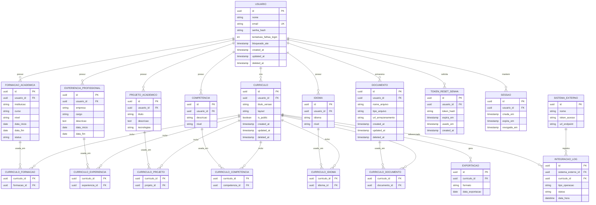

# Diagrama Entidade-Relacionamento — Sistema de Currículos FATEC

Versão consolidada (Yasmin + Gnann).

```mermaid
erDiagram
  USUARIO ||--o{ FORMACAO_ACADEMICA : possui
  USUARIO ||--o{ EXPERIENCIA_PROFISSIONAL : possui
  USUARIO ||--o{ PROJETO_ACADEMICO : possui
  USUARIO ||--o{ COMPETENCIA : possui
  USUARIO ||--o{ IDIOMA : possui
  USUARIO ||--o{ DOCUMENTO : armazena
  USUARIO ||--o{ CURRICULO : cria
  USUARIO ||--o{ TOKEN_RESET_SENHA : solicita
  USUARIO ||--o{ SESSAO : mantem

  CURRICULO ||--o{ CURRICULO_FORMACAO : inclui
  FORMACAO_ACADEMICA ||--o{ CURRICULO_FORMACAO : usada_em

  CURRICULO ||--o{ CURRICULO_EXPERIENCIA : inclui
  EXPERIENCIA_PROFISSIONAL ||--o{ CURRICULO_EXPERIENCIA : usada_em

  CURRICULO ||--o{ CURRICULO_PROJETO : inclui
  PROJETO_ACADEMICO ||--o{ CURRICULO_PROJETO : usado_em

  CURRICULO ||--o{ CURRICULO_COMPETENCIA : inclui
  COMPETENCIA ||--o{ CURRICULO_COMPETENCIA : usada_em

  CURRICULO ||--o{ CURRICULO_IDIOMA : inclui
  IDIOMA ||--o{ CURRICULO_IDIOMA : usado_em

  CURRICULO ||--o{ CURRICULO_DOCUMENTO : anexa
  DOCUMENTO ||--o{ CURRICULO_DOCUMENTO : usado_em

  CURRICULO ||--o{ EXPORTACAO : gera

  SISTEMA_EXTERNO ||--o{ INTEGRACAO_LOG : registra
  CURRICULO ||--o{ INTEGRACAO_LOG : referenciado

  USUARIO {
    uuid id PK
    string nome
    string email UK
    string senha_hash
    int tentativas_falhas_login
    timestamp bloqueado_ate
    timestamp created_at
    timestamp updated_at
    timestamp deleted_at
  }

  FORMACAO_ACADEMICA {
    uuid id PK
    uuid usuario_id FK
    string instituicao
    string curso
    string nivel
    date data_inicio
    date data_fim
    string status
  }

  EXPERIENCIA_PROFISSIONAL {
    uuid id PK
    uuid usuario_id FK
    string empresa
    string cargo
    text descricao
    date data_inicio
    date data_fim
  }

  PROJETO_ACADEMICO {
    uuid id PK
    uuid usuario_id FK
    string titulo
    text descricao
    string tecnologias
  }

  COMPETENCIA {
    uuid id PK
    uuid usuario_id FK
    string descricao
    string nivel
  }

  IDIOMA {
    uuid id PK
    uuid usuario_id FK
    string idioma
    string nivel
  }

  DOCUMENTO {
    uuid id PK
    uuid usuario_id FK
    string nome_arquivo
    string tipo_arquivo
    string url_armazenamento
    timestamp created_at
    timestamp updated_at
    timestamp deleted_at
  }

  CURRICULO {
    uuid id PK
    uuid usuario_id FK
    string titulo_versao
    string layout
    boolean is_public
    timestamp created_at
    timestamp updated_at
    timestamp deleted_at
  }

  CURRICULO_FORMACAO {
    uuid curriculo_id FK
    uuid formacao_id FK
  }

  CURRICULO_EXPERIENCIA {
    uuid curriculo_id FK
    uuid experiencia_id FK
  }

  CURRICULO_PROJETO {
    uuid curriculo_id FK
    uuid projeto_id FK
  }

  CURRICULO_COMPETENCIA {
    uuid curriculo_id FK
    uuid competencia_id FK
  }

  CURRICULO_IDIOMA {
    uuid curriculo_id FK
    uuid idioma_id FK
  }

  CURRICULO_DOCUMENTO {
    uuid curriculo_id FK
    uuid documento_id FK
  }

  EXPORTACAO {
    uuid id PK
    uuid curriculo_id FK
    string formato
    date data_exportacao
  }

  SISTEMA_EXTERNO {
    uuid id PK
    string nome
    string token_acesso
    string url_endpoint
  }

  INTEGRACAO_LOG {
    uuid id PK
    uuid sistema_externo_id FK
    uuid curriculo_id FK
    string tipo_operacao
    string status
    datetime data_hora
  }

  TOKEN_RESET_SENHA {
    uuid id PK
    uuid usuario_id FK
    string token_hash
    timestamp expira_em
    timestamp usado_em
    timestamp created_at
  }

  SESSAO {
    uuid id PK
    uuid usuario_id FK
    timestamp criada_em
    timestamp expira_em
    timestamp revogada_em
  }
```
