# Requisitos de Segurança

## 1. Visão geral

O sistema tem como objetivo apoiar estudantes na organização de informações pessoais e profissionais e na construção de currículos. Para isso, serão tratados dados como nome, endereço, telefone, e-mail, formação acadêmica, idiomas, perfil profissional, habilidades e competências, cursos, certificações e experiências profissionais.

Diante da natureza dessas informações, a arquitetura de segurança deverá considerar três aspectos complementares:

* **Autenticação:** identificação do usuário;
* **Autorização:** definição das operações e recursos que o usuário pode acessar;
* **Proteção de dados:** medidas aplicadas durante coleta, transmissão, armazenamento, utilização, compartilhamento, retenção e exclusão das informações.

A relação entre esses componentes é representada abaixo:

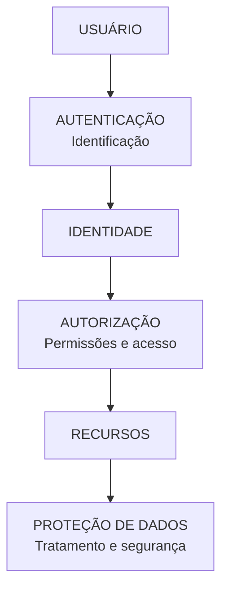
```mermaid
flowchart TD
    A[USUÁRIO] --> B[AUTENTICAÇÃO<br>Identificação]
    B --> C[IDENTIDADE]
    C --> D[AUTORIZAÇÃO<br>Permissões e acesso]
    D --> E[RECURSOS]
    E --> F[PROTEÇÃO DE DADOS<br>Tratamento e segurança]
```

---

# 2. Planejamento de Autenticação

## 2.1 Objetivo

O sistema deverá possuir um mecanismo de autenticação capaz de identificar de forma segura cada usuário e permitir o acesso à sua conta e aos seus currículos.

A autenticação deverá garantir que os dados pessoais e profissionais cadastrados estejam associados a uma conta persistente, permitindo que o usuário retorne ao sistema e continue utilizando seus dados e currículos.

## 2.2 Método de autenticação

Considerando os serviços utilizados como referência para o projeto, será considerado inicialmente o modelo de autenticação por:

**E-mail e senha.**

A possibilidade de utilização de provedores externos de identidade será mantida como item em análise.

Entre as alternativas que poderão ser avaliadas está a autenticação por conta Google ou por outros provedores compatíveis.

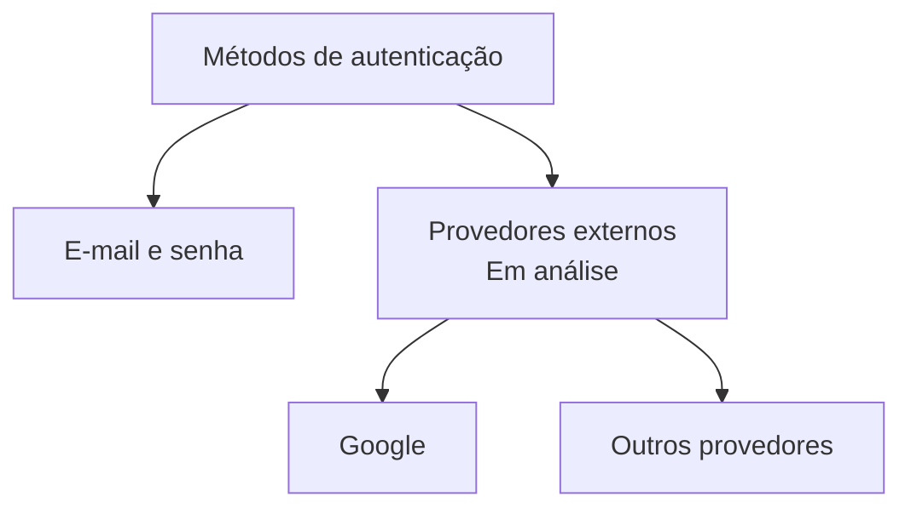
```mermaid
flowchart TD
    A[Métodos de autenticação] --> B[E-mail e senha]
    A --> C[Provedores externos<br>Em análise]
    C --> D[Google]
    C --> E[Outros provedores]
```

A definição definitiva dos métodos adicionais dependerá da avaliação dos requisitos técnicos, de segurança e de experiência do usuário.

## 2.3 Cadastro

O cadastro deverá solicitar somente as informações necessárias para criação e manutenção da conta.

O fluxo previsto é:

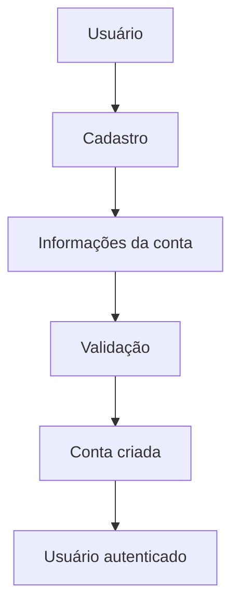
```mermaid
flowchart TD
    A[Usuário] --> B[Cadastro]
    B --> C[Informações da conta]
    C --> D[Validação]
    D --> E[Conta criada]
    E --> F[Usuário autenticado]
```

Os dados utilizados para autenticação deverão ser mantidos conceitualmente separados dos dados utilizados para elaboração do currículo.

## 2.4 Senhas

As senhas não deverão ser armazenadas em texto puro.

O armazenamento deverá utilizar mecanismo adequado de derivação de senha, com salt e parâmetros apropriados para dificultar ataques de descoberta de credenciais.

Conceitualmente:

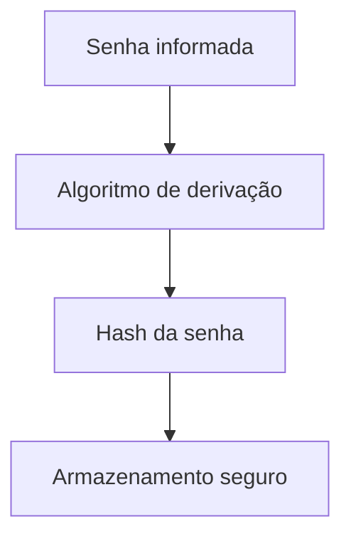
```mermaid
flowchart TD
    A[Senha informada] --> B[Algoritmo de derivação]
    B --> C[Hash da senha]
    C --> D[Armazenamento seguro]
```

Durante o processo de login:

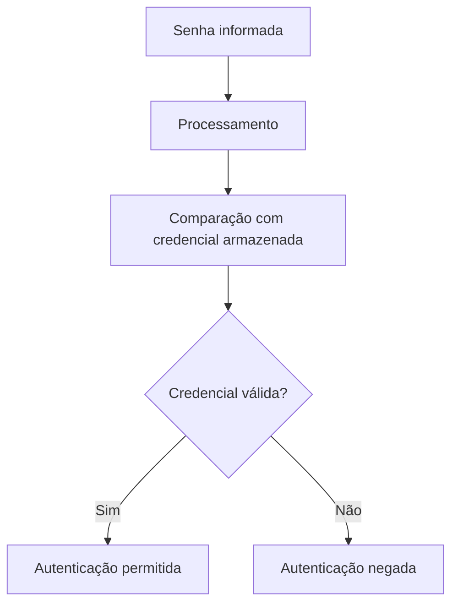
```mermaid
flowchart TD
    A[Senha informada] --> B[Processamento]
    B --> C[Comparação com credencial armazenada]
    C --> D{Credencial válida?}
    D -->|Sim| E[Autenticação permitida]
    D -->|Não| F[Autenticação negada]
```

A escolha do algoritmo e de seus parâmetros deverá ser definida durante a implementação técnica.

## 2.5 Login

O usuário deverá poder autenticar-se utilizando suas credenciais.

Fluxo:

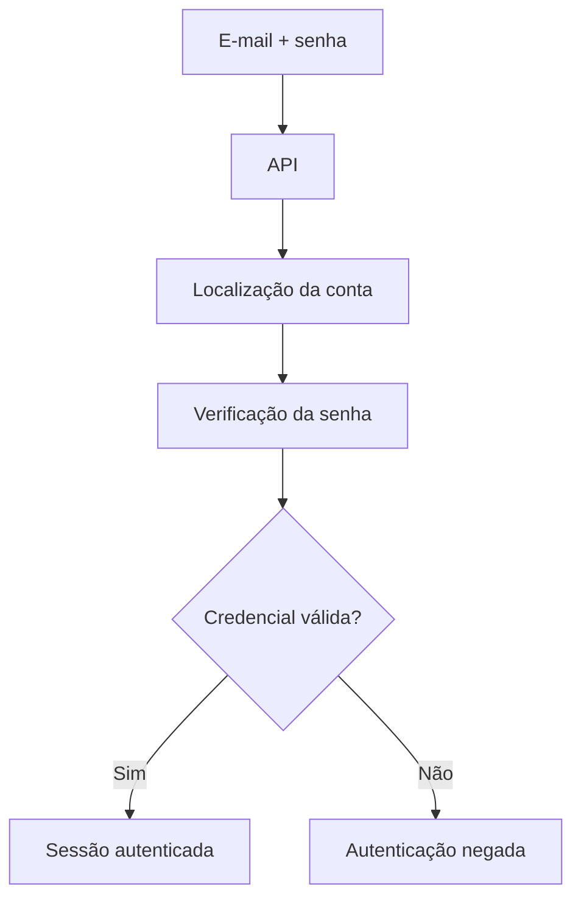
```mermaid
flowchart TD
    A[E-mail + senha] --> B[API]
    B --> C[Localização da conta]
    C --> D[Verificação da senha]
    D --> E{Credencial válida?}
    E -->|Sim| F[Sessão autenticada]
    E -->|Não| G[Autenticação negada]
```

As mensagens apresentadas ao usuário não deverão revelar informações desnecessárias sobre a existência ou inexistência de determinada conta.

## 2.6 Sessão

Após a autenticação, o sistema deverá estabelecer uma sessão autenticada.

O usuário não deverá precisar informar novamente sua senha a cada operação realizada durante uma sessão válida.

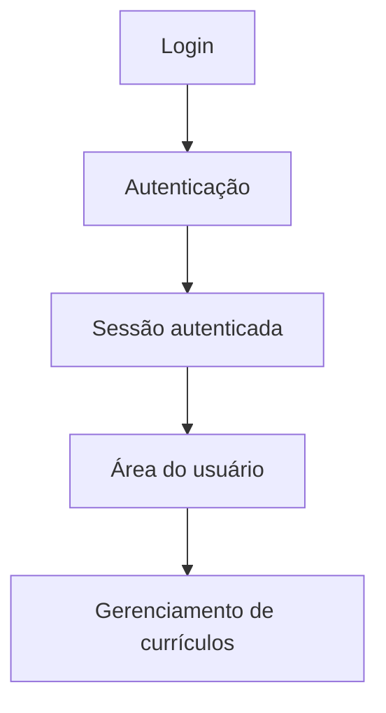
```mermaid
flowchart TD
    A[Login] --> B[Autenticação]
    B --> C[Sessão autenticada]
    C --> D[Área do usuário]
    D --> E[Gerenciamento de currículos]
```

A implementação deverá considerar:

* expiração da sessão;
* encerramento por logout;
* proteção contra utilização indevida;
* armazenamento seguro das informações de sessão;
* comunicação protegida por HTTPS/TLS.

Quando forem utilizados cookies para gerenciamento da sessão, deverão ser considerados atributos de segurança apropriados, como:

* `Secure`;
* `HttpOnly`;
* `SameSite`.

## 2.7 Logout

O sistema deverá disponibilizar uma operação explícita de logout.

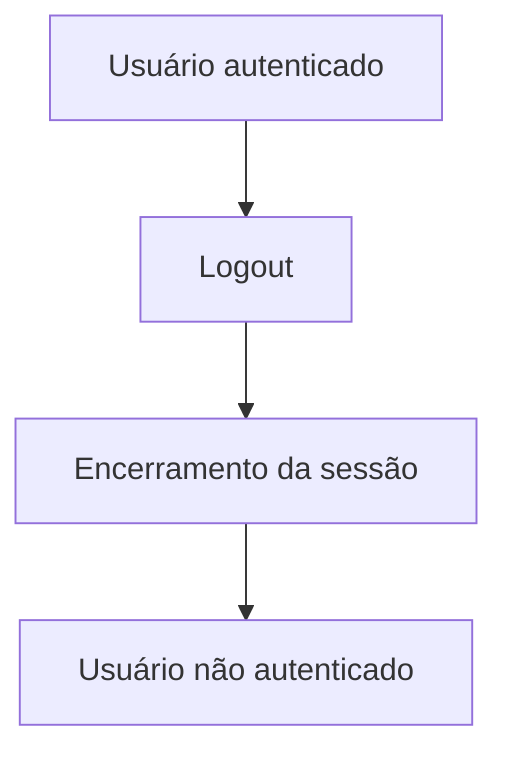
```mermaid
flowchart TD
    A[Usuário autenticado] --> B[Logout]
    B --> C[Encerramento da sessão]
    C --> D[Usuário não autenticado]
```

O encerramento deverá invalidar a sessão correspondente.

## 2.8 Recuperação de senha

Deverá existir mecanismo para recuperação do acesso à conta.

Fluxo:

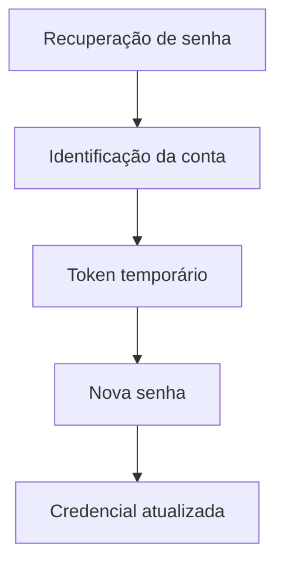
```mermaid
flowchart TD
    A[Recuperação de senha] --> B[Identificação da conta]
    B --> C[Token temporário]
    C --> D[Nova senha]
    D --> E[Credencial atualizada]
```

O mecanismo deverá considerar:

* validade limitada do token;
* utilização única do token;
* proteção do token durante transmissão e armazenamento;
* não exposição do token em logs.

## 2.9 Verificação de e-mail

A verificação do endereço de e-mail será considerada como requisito do mecanismo de autenticação, principalmente por sua relação com a recuperação de conta.

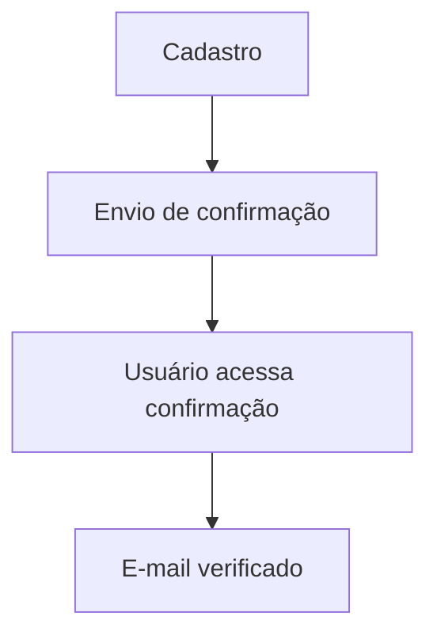
```mermaid
flowchart TD
    A[Cadastro] --> B[Envio de confirmação]
    B --> C[Usuário acessa confirmação]
    C --> D[E-mail verificado]
```

A forma definitiva de implementação será definida durante a especificação técnica da aplicação.

## 2.10 Proteção contra tentativas excessivas

O mecanismo de autenticação deverá possuir proteção contra tentativas excessivas de acesso.

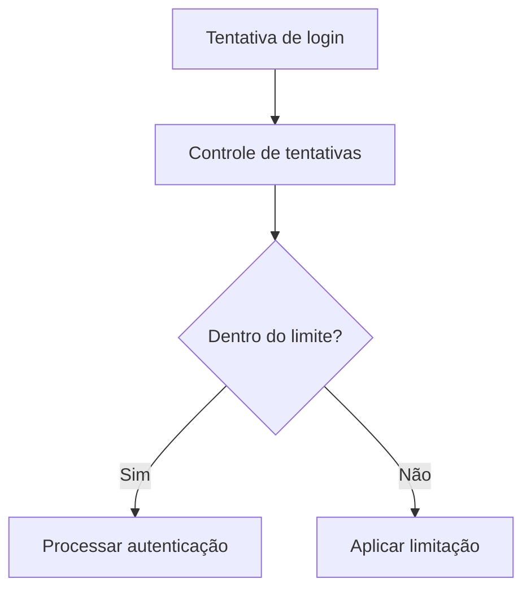
```mermaid
flowchart TD
    A[Tentativa de login] --> B[Controle de tentativas]
    B --> C{Dentro do limite?}
    C -->|Sim| D[Processar autenticação]
    C -->|Não| E[Aplicar limitação]
```

A estratégia poderá envolver limitação de requisições, retardamento progressivo ou outros mecanismos adequados.

Os parâmetros específicos deverão ser definidos durante a implementação.

## 2.11 Requisitos

**RF-AUT-01**
O sistema deverá permitir o cadastro de usuários mediante e-mail e senha.

**RF-AUT-02**
O sistema deverá permitir que usuários cadastrados realizem login utilizando suas credenciais.

**RF-AUT-03**
O sistema deverá manter uma conta persistente associada ao usuário.

**RF-AUT-04**
O sistema deverá permitir o encerramento da sessão por meio da função de logout.

**RF-AUT-05**
O sistema deverá disponibilizar mecanismo de recuperação de senha.

**RF-AUT-06**
O sistema deverá permitir a alteração da senha pelo usuário autenticado.

**RF-AUT-07**
O sistema não deverá armazenar senhas em texto puro.

**RF-AUT-08**
O mecanismo de autenticação deverá possuir proteção contra tentativas excessivas de acesso.

**RF-AUT-09**
O sistema deverá utilizar comunicação segura durante os processos de autenticação.

**RF-AUT-10**
O sistema deverá controlar a validade das sessões autenticadas.

**RF-AUT-11**
O sistema deverá considerar a verificação do endereço de e-mail como parte do mecanismo de gerenciamento da conta.

## 2.12 Itens em análise

Os seguintes recursos permanecem em análise:

* autenticação por Google;
* autenticação por outros provedores de identidade;
* autenticação multifator (MFA);
* outros mecanismos complementares de autenticação.

A adoção desses recursos dependerá da definição da arquitetura da aplicação e da avaliação de seus requisitos.

---

# 3. Planejamento de Autorização

A autenticação estabelece a identidade do usuário. A autorização determina quais funcionalidades e recursos essa identidade poderá acessar.

## 3.1 Objetivo

O sistema deverá controlar o acesso às funcionalidades e aos recursos de acordo com as permissões atribuídas ao usuário.

O principal objetivo será garantir que cada usuário possa acessar e modificar somente os dados e currículos para os quais possui autorização.

A autorização deverá ser aplicada tanto às funcionalidades quanto aos recursos individuais.

## 3.2 Modelo de autorização

Será considerado um modelo baseado em papéis, RBAC, combinado com a propriedade dos recursos.

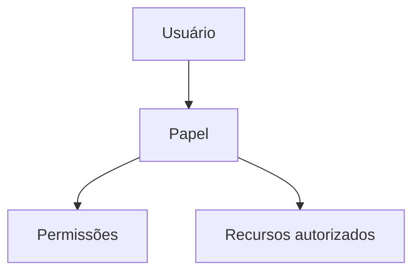
```mermaid
flowchart TD
    A[Usuário] --> B[Papel]
    B --> C[Permissões]
    B --> D[Recursos autorizados]
```

Inicialmente, serão considerados os papéis:

**USER**
Usuário comum do sistema.

**ADMIN**
Usuário responsável por funções administrativas.

A definição final das permissões associadas a cada papel será realizada durante a implementação e validação da arquitetura.

## 3.3 Usuário comum

O usuário comum deverá acessar os recursos pertencentes à própria conta.

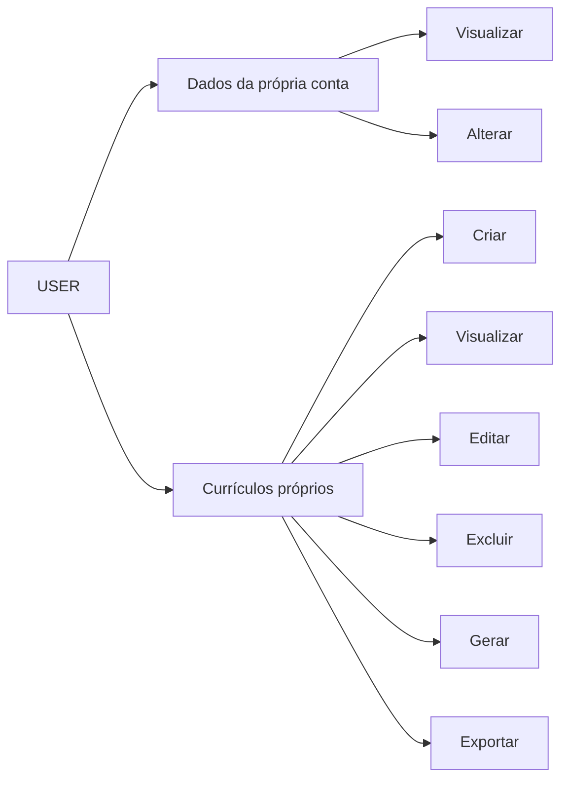
```mermaid
flowchart LR
    A[USER] --> B[Dados da própria conta]
    B --> C[Visualizar]
    B --> D[Alterar]

    A --> E[Currículos próprios]
    E --> F[Criar]
    E --> G[Visualizar]
    E --> H[Editar]
    E --> I[Excluir]
    E --> J[Gerar]
    E --> K[Exportar]
```

O acesso a recursos pertencentes a outro usuário deverá ser negado.

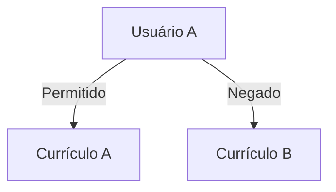
```mermaid
flowchart TD
    A[Usuário A] -->|Permitido| B[Currículo A]
    A -->|Negado| C[Currículo B]
```

A verificação deverá ocorrer no backend.

## 3.4 Administrador

Caso a aplicação disponibilize uma área administrativa, deverão existir permissões específicas para as operações administrativas.

Exemplos:

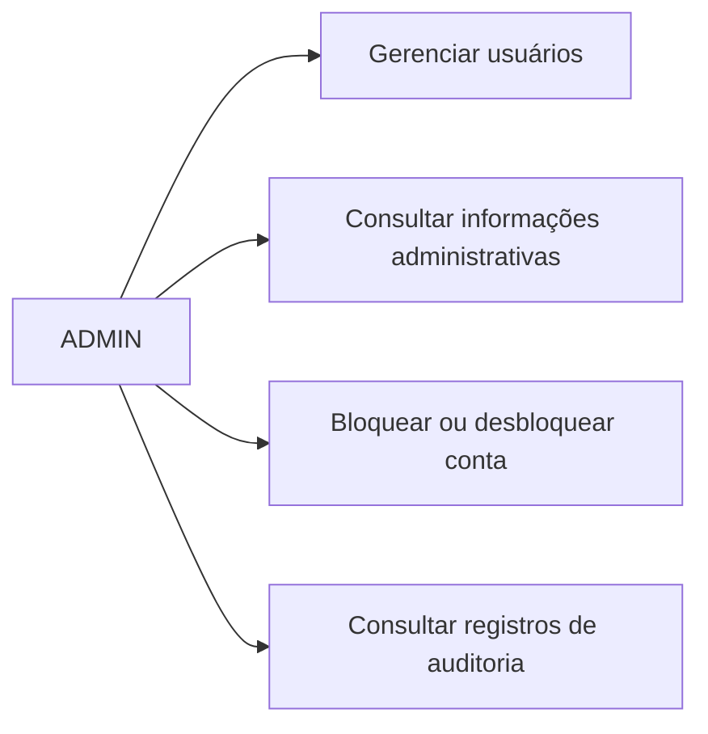
```mermaid
flowchart LR
    A[ADMIN] --> B[Gerenciar usuários]
    A --> C[Consultar informações administrativas]
    A --> D[Bloquear ou desbloquear conta]
    A --> E[Consultar registros de auditoria]
```

O papel de administrador não deverá representar, por si só, acesso irrestrito aos dados pessoais.

O acesso administrativo deverá possuir finalidade definida e ser limitado às operações necessárias.

## 3.5 Permissões

As permissões deverão ser definidas de forma específica.

Entre as permissões consideradas estão:

* `user.read`;
* `user.update`;
* `user.delete`;
* `resume.create`;
* `resume.read`;
* `resume.update`;
* `resume.delete`;
* `resume.export`;
* `resume.share`;
* `admin.user.manage`;
* `admin.audit.read`.

A associação entre papéis e permissões deverá considerar também a propriedade do recurso.

| Permissão           | USER          | ADMIN                |
| ------------------- | ------------- | -------------------- |
| `user.read`         | Própria conta | Conforme necessidade |
| `user.update`       | Própria conta | Conforme necessidade |
| `user.delete`       | Própria conta | Conforme política    |
| `resume.create`     | Sim           | Conforme necessidade |
| `resume.read`       | Próprios      | Conforme necessidade |
| `resume.update`     | Próprios      | Conforme necessidade |
| `resume.delete`     | Próprios      | Conforme necessidade |
| `resume.export`     | Próprios      | Conforme necessidade |
| `resume.share`      | Próprios      | Conforme necessidade |
| `admin.user.manage` | Não           | Sim                  |
| `admin.audit.read`  | Não           | Sim                  |

A definição apresentada deverá ser validada durante a implementação. O papel `ADMIN` não deverá ser interpretado automaticamente como permissão irrestrita.

## 3.6 Verificação de propriedade

Sempre que um usuário tentar acessar um recurso, o backend deverá verificar a autorização correspondente.

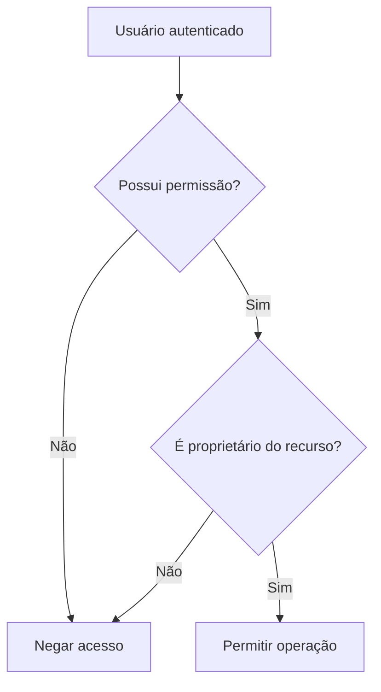
```mermaid
flowchart TD
    A[Usuário autenticado] --> B{Possui permissão?}
    B -->|Não| C[Negar acesso]
    B -->|Sim| D{É proprietário do recurso?}
    D -->|Não| C
    D -->|Sim| E[Permitir operação]
```

Por exemplo, uma requisição para um currículo deverá considerar tanto o identificador do currículo quanto o usuário autenticado.

Conceitualmente:

```sql
SELECT *
FROM curriculos
WHERE id = 123
AND usuario_id = usuario_autenticado;
```

A implementação concreta dependerá da tecnologia adotada.

## 3.7 Proteção contra acesso direto

O sistema não deverá confiar exclusivamente em identificadores fornecidos pelo cliente.

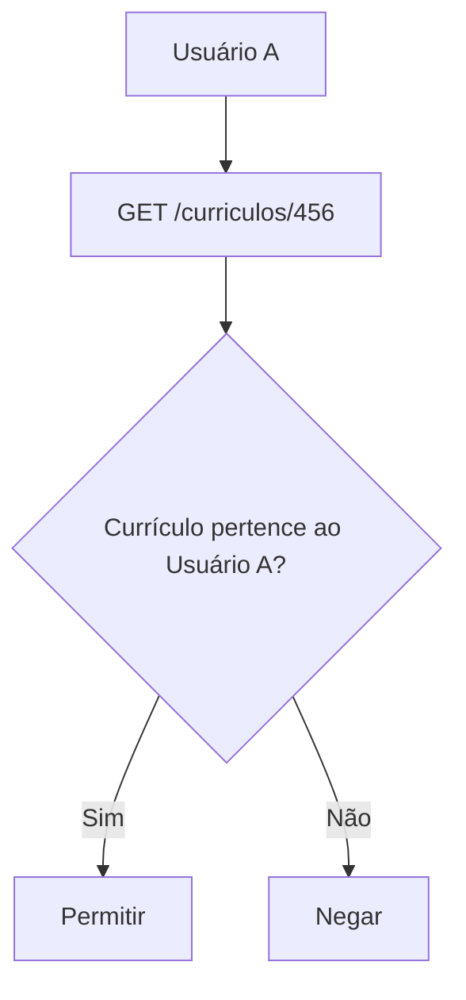
```mermaid
flowchart TD
    A[Usuário A] --> B["GET /curriculos/456"]
    B --> C{Currículo pertence ao Usuário A?}
    C -->|Sim| D[Permitir]
    C -->|Não| E[Negar]
```

A mesma regra deverá ser aplicada a:

* currículos;
* arquivos;
* dados pessoais;
* documentos gerados;
* demais recursos privados.

A alteração de um identificador na URL, no corpo da requisição ou em parâmetros não deverá permitir acesso indevido.

## 3.8 Princípio do menor privilégio

Usuários e componentes do sistema deverão receber somente as permissões necessárias para suas respectivas funções.

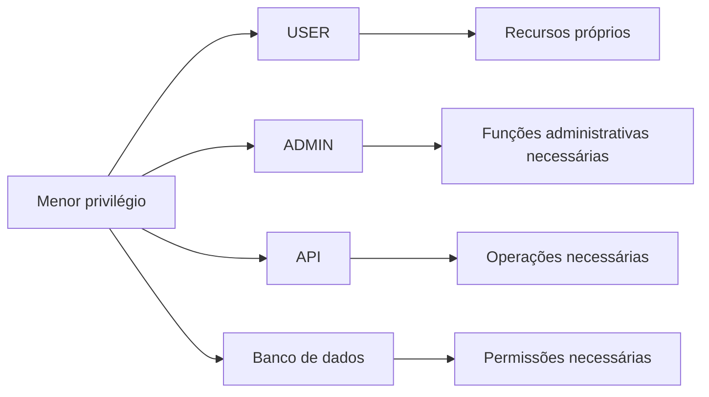
```mermaid
flowchart LR
    A[Menor privilégio] --> B[USER]
    A --> C[ADMIN]
    A --> D[API]
    A --> E[Banco de dados]

    B --> F[Recursos próprios]
    C --> G[Funções administrativas necessárias]
    D --> H[Operações necessárias]
    E --> I[Permissões necessárias]
```

O princípio deverá ser aplicado também aos componentes internos da aplicação.

## 3.9 Negação por padrão

O comportamento padrão deverá ser negar operações que não estejam explicitamente autorizadas.

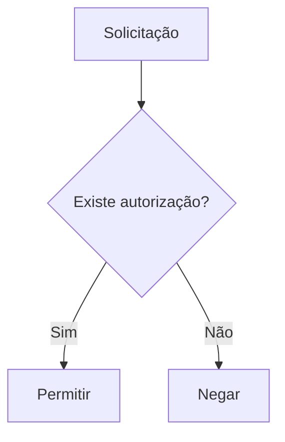
```mermaid
flowchart TD
    A[Solicitação] --> B{Existe autorização?}
    B -->|Sim| C[Permitir]
    B -->|Não| D[Negar]
```

## 3.10 Autorização no backend

A interface poderá ocultar funcionalidades não disponíveis ao usuário, mas isso não deverá ser considerado um mecanismo de segurança.

A autorização deverá ser validada no servidor.

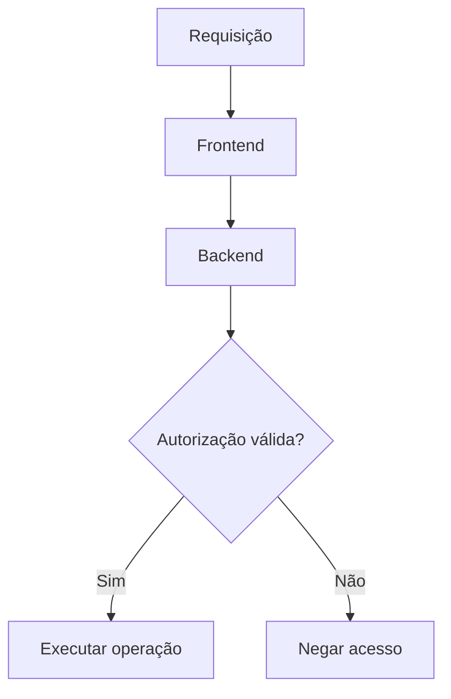
```mermaid
flowchart TD
    A[Requisição] --> B[Frontend]
    B --> C[Backend]
    C --> D{Autorização válida?}
    D -->|Sim| E[Executar operação]
    D -->|Não| F[Negar acesso]
```

## 3.11 Auditoria

Operações administrativas relevantes deverão possuir mecanismos de registro para fins de auditoria.

Exemplo:

| Data/hora        | Usuário       | Operação            | Recurso | Resultado |
| ---------------- | ------------- | ------------------- | ------- | --------- |
| 10/09/2026 17:20 | Administrador | Alteração de status | Usuário | Sucesso   |

Os registros não deverão armazenar senhas, tokens ou outras credenciais.

## 3.12 Requisitos

**RF-AUTZ-01**
O sistema deverá controlar o acesso às funcionalidades de acordo com as permissões do usuário autenticado.

**RF-AUTZ-02**
O sistema deverá considerar os papéis de usuário comum e administrador.

**RF-AUTZ-03**
O usuário comum deverá acessar somente os dados e recursos pertencentes à sua própria conta.

**RF-AUTZ-04**
O usuário deverá poder criar, visualizar, editar e excluir seus próprios currículos, conforme as funcionalidades disponibilizadas.

**RF-AUTZ-05**
O sistema deverá impedir o acesso ou modificação de currículos pertencentes a outro usuário.

**RF-AUTZ-06**
O sistema deverá validar a autorização no servidor para as operações protegidas.

**RF-AUTZ-07**
O sistema não deverá confiar exclusivamente em identificadores fornecidos pelo cliente para determinar autorização.

**RF-AUTZ-08**
As permissões administrativas deverão ser concedidas somente aos usuários autorizados.

**RF-AUTZ-09**
O sistema deverá aplicar o princípio do menor privilégio.

**RF-AUTZ-10**
O sistema deverá utilizar negação por padrão para operações sem autorização explícita.

**RF-AUTZ-11**
Caso seja disponibilizado compartilhamento de currículos, o sistema deverá possuir regras específicas de autorização para essa funcionalidade.

**RF-AUTZ-12**
Operações administrativas relevantes deverão possuir mecanismos de auditoria.

## 3.13 Itens em análise

Permanecem em análise:

* compartilhamento de currículo por link;
* currículo público;
* permissões mais granulares;
* compartilhamento com usuários específicos;
* definição detalhada das permissões administrativas.

---

# 4. Planejamento de Proteção de Dados

## 4.1 Objetivo

O sistema deverá proteger os dados pessoais e profissionais fornecidos pelos usuários durante todo o seu ciclo de vida.

A proteção deverá considerar coleta, transmissão, armazenamento, utilização, acesso, compartilhamento, retenção e exclusão.

O projeto prevê informações como nome, endereço, telefone, e-mail, formação acadêmica, idiomas, perfil profissional, habilidades e competências, cursos, certificações e experiências profissionais.

## 4.2 Minimização de dados

O sistema deverá coletar somente as informações necessárias para as funcionalidades disponibilizadas.

A inclusão de novos campos deverá considerar:

```mermaid
flowchart TD
    A[Novo dado] --> B{É necessário?}
    B -->|Não| C[Não coletar]
    B -->|Sim| D[Definir finalidade]
    D --> E[Definir necessidade de acesso]
    E --> F[Definir retenção]
```

## 4.3 Classificação dos dados

Os dados deverão ser classificados de acordo com sua finalidade e necessidade de proteção.

```mermaid
flowchart LR
    A[Dados] --> B[Públicos]
    A --> C[Internos]
    A --> D[Pessoais]
    A --> E[Restritos]

    B --> F[Informações destinadas à divulgação]
    C --> G[Informações utilizadas internamente]
    D --> H[Informações relacionadas ao usuário]
    E --> I[Credenciais e segredos]
```

Para o projeto, serão considerados, entre outros:

| Informação               | Classificação             |
| ------------------------ | ------------------------- |
| Nome                     | Dado pessoal              |
| E-mail                   | Dado pessoal              |
| Telefone                 | Dado pessoal              |
| Endereço                 | Dado pessoal              |
| Formação acadêmica       | Dado pessoal/profissional |
| Experiência profissional | Dado pessoal/profissional |
| Senha                    | Credencial restrita       |
| Token de recuperação     | Segredo temporário        |

## 4.4 Proteção durante a transmissão

A comunicação entre cliente e servidor deverá utilizar HTTPS/TLS.

```mermaid
flowchart LR
    A[Usuário] -->|HTTPS / TLS| B[Servidor]
    B --> C[Banco de dados]
```

A proteção deverá ser aplicada especialmente a:

* cadastro;
* login;
* alteração de dados;
* criação e edição de currículos;
* recuperação de senha;
* download de documentos.

## 4.5 Proteção no armazenamento

Os dados deverão possuir controles de acesso adequados.

Deverão ser protegidos, conforme aplicabilidade:

* banco de dados;
* arquivos de currículo;
* documentos gerados;
* backups;
* tokens;
* credenciais utilizadas pelos serviços.

```mermaid
flowchart TD
    A[Aplicação] --> B[Banco de dados]
    A --> C[Armazenamento de arquivos]

    B --> D[Dados de usuários e currículos]
    C --> E[Documentos gerados]

    D --> F[Controle de acesso]
    E --> F
```

## 4.6 Controle de acesso aos dados

A proteção dos dados deverá estar integrada ao mecanismo de autorização.

```mermaid
flowchart TD
    A[Usuário autenticado] --> B{Possui permissão?}
    B -->|Não| E[Acesso negado]
    B -->|Sim| C{Possui autorização sobre o recurso?}
    C -->|Não| E
    C -->|Sim| D[Operação permitida]
```

O usuário não deverá visualizar ou modificar dados pertencentes a outra conta.

## 4.7 Privacidade por padrão

Os currículos deverão ser considerados privados por padrão.

```mermaid
flowchart TD
    A[Novo currículo] --> B[PRIVADO]
```

Qualquer mecanismo que aumente a exposição das informações deverá depender de uma ação explícita do usuário.

Isso é particularmente relevante para informações como endereço e telefone, que podem fazer parte do currículo, mas não devem ser automaticamente disponibilizadas publicamente.

## 4.8 Logs

O sistema poderá registrar eventos necessários à operação, segurança e auditoria.

Os registros não deverão expor credenciais ou segredos.

Não deverão ser registrados:

```text
senha=...
token=...
```

Também deverão ser evitadas informações pessoais que não sejam necessárias ao objetivo do log.

Um registro de auditoria poderá possuir estrutura semelhante a:

```text
Usuário: 42
Operação: alteração de currículo
Recurso: currículo 123
Data/hora: 10/09/2026 17:30
Resultado: sucesso
```

## 4.9 Backups

Os backups deverão receber proteção compatível com a importância dos dados armazenados.

Deverão ser definidos durante a implementação:

* frequência dos backups;
* período de retenção;
* controle de acesso;
* proteção contra alteração não autorizada;
* proteção durante armazenamento;
* procedimento de restauração;
* descarte de backups expirados.

## 4.10 Retenção e exclusão

O sistema deverá possuir critérios para retenção e exclusão dos dados.

O ciclo de vida previsto é:

```mermaid
flowchart TD
    A[Coleta] --> B[Armazenamento]
    B --> C[Utilização]
    C --> D[Alteração]
    D --> E[Compartilhamento<br>quando aplicável]
    E --> F[Retenção]
    F --> G[Exclusão]
```

A definição dos períodos de retenção deverá considerar a finalidade dos dados e as obrigações aplicáveis.

Também deverão ser considerados dados presentes em:

* banco principal;
* backups;
* arquivos;
* logs;
* caches.

## 4.11 Direitos do usuário

O sistema deverá considerar mecanismos que permitam ao usuário exercer, conforme aplicabilidade, direitos relacionados aos seus dados.

Entre os mecanismos a serem considerados estão:

* consulta dos dados;
* correção das informações;
* solicitação de exclusão;
* informações sobre o tratamento;
* gerenciamento de compartilhamento;
* solicitações relacionadas à utilização dos dados.

A implementação desses mecanismos deverá considerar a legislação aplicável ao projeto, incluindo a LGPD.

## 4.12 Compartilhamento

O compartilhamento de informações deverá ocorrer somente quando houver funcionalidade específica para essa finalidade e conforme as regras de autorização estabelecidas.

Por padrão:

```mermaid
flowchart TD
    A[Dados do usuário] --> B[Usuário e sistema autorizado]
```

Caso seja disponibilizado compartilhamento:

```mermaid
flowchart TD
    A[Usuário] --> B[Escolha de compartilhar]
    B --> C[Seleção do recurso]
    C --> D[Definição de visibilidade]
    D --> E[Compartilhamento]
```

O compartilhamento deverá limitar-se ao conteúdo necessário para a finalidade definida.

## 4.13 Gestão de segredos

Credenciais utilizadas pela aplicação não deverão ser armazenadas diretamente no código-fonte.

Isso inclui:

* senhas de banco de dados;
* chaves de API;
* tokens;
* credenciais AWS;
* segredos da aplicação.

A estratégia de gerenciamento desses valores deverá ser definida durante a implementação da infraestrutura.

## 4.14 Segurança dos arquivos

Arquivos de currículo e documentos gerados deverão ser tratados como recursos protegidos.

Deverão ser definidas regras para:

* criação;
* visualização;
* download;
* armazenamento;
* retenção;
* exclusão;
* controle de acesso.

O acesso aos arquivos não deverá depender somente do conhecimento de uma URL.

## 4.15 Requisitos

**RF-DADOS-01**
O sistema deverá coletar somente os dados necessários para suas funcionalidades.

**RF-DADOS-02**
O sistema deverá proteger os dados pessoais contra acesso, alteração, divulgação ou exclusão não autorizados.

**RF-DADOS-03**
A transmissão de dados entre cliente e servidor deverá utilizar comunicação segura.

**RF-DADOS-04**
As senhas deverão ser armazenadas utilizando mecanismo seguro de derivação.

**RF-DADOS-05**
O acesso aos dados deverá ser condicionado à autenticação e autorização adequadas.

**RF-DADOS-06**
Os currículos deverão ser tratados como privados por padrão.

**RF-DADOS-07**
O sistema deverá controlar o acesso aos arquivos e documentos gerados.

**RF-DADOS-08**
O sistema não deverá armazenar credenciais ou tokens em código-fonte ou logs.

**RF-DADOS-09**
Os backups deverão possuir proteção e controle de acesso adequados.

**RF-DADOS-10**
O sistema deverá estabelecer critérios para retenção e exclusão dos dados.

**RF-DADOS-11**
O sistema deverá considerar mecanismos para consulta, correção e solicitação de exclusão dos dados pelo usuário, conforme aplicabilidade.

**RF-DADOS-12**
Operações relevantes deverão poder ser auditadas sem exposição desnecessária de informações pessoais ou credenciais.

## 4.16 Itens em análise

Permanecem em análise:

* compartilhamento por link;
* currículo público;
* controle avançado de consentimentos;
* criptografia adicional de campos específicos;
* gerenciamento avançado de chaves;
* mecanismos avançados de anonimização;
* definição detalhada dos períodos de retenção;
* estratégia definitiva de backup e restauração.

---

# 5. Integração dos controles de segurança

Os três mecanismos deverão atuar de maneira integrada.

```mermaid
flowchart TD
    A[USUÁRIO] --> B[AUTENTICAÇÃO]
    B --> C[IDENTIDADE]
    C --> D[AUTORIZAÇÃO]

    D --> E[PAPEL]
    D --> F[PROPRIEDADE DO RECURSO]

    E --> G[PERMISSÕES]
    F --> G

    G --> H[ACESSO AO RECURSO]
    H --> I[PROTEÇÃO DOS DADOS]
```

A autenticação estabelece **quem é o usuário**.

A autorização estabelece **o que o usuário pode acessar ou fazer**.

A proteção de dados estabelece **como as informações devem ser tratadas e protegidas durante seu ciclo de vida**.

Essa separação permite que os controles sejam definidos de forma independente, mas aplicados conjuntamente.
